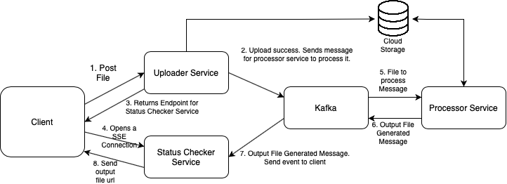

# Image Processing Service

- This is a scalable service for resizing images online
- Uses: Spring Boot, Kafka, and Server Sent Events (SSE)

### Steps to Run:
1.  Run in terminal: `docker-compose -f docker-compose.yml up`
2. Goto: http://localhost:8080/file

### Todo
1. Add load balancers for services
2. Add a cleanup service for files which will remove expired files from the system
3. Images stored locally. Change to a cloud storage